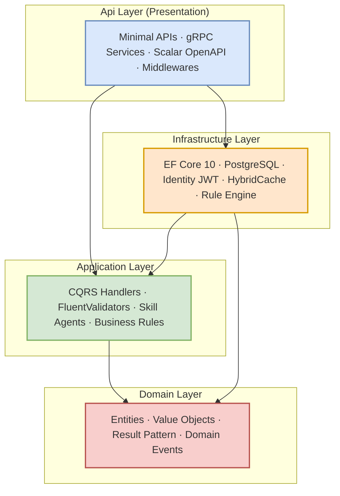
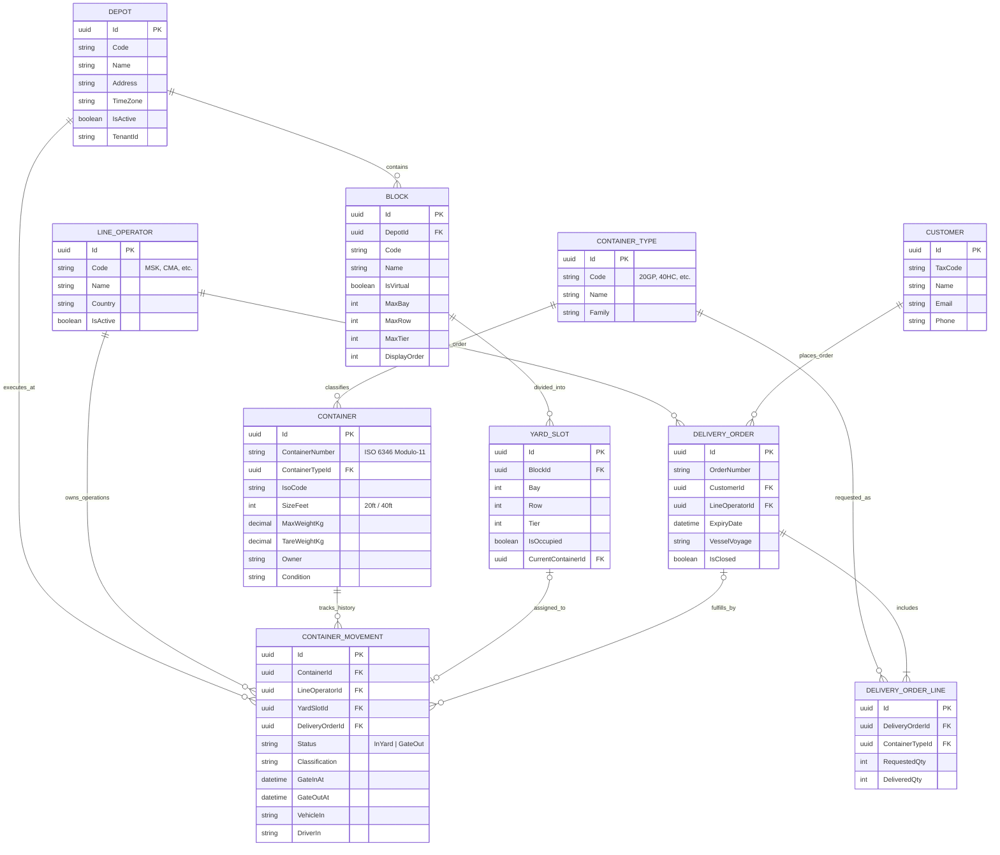
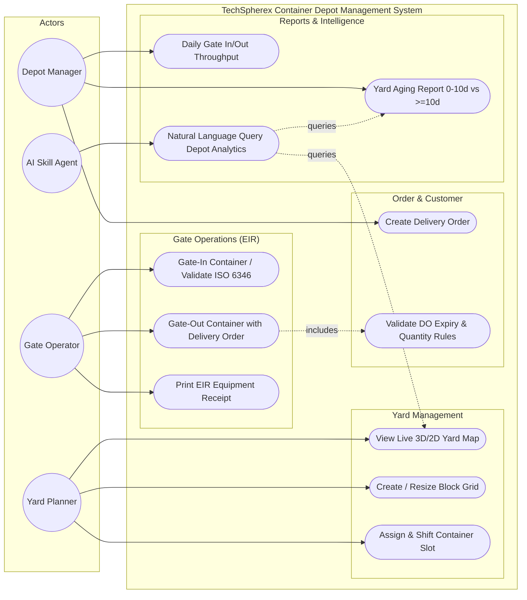
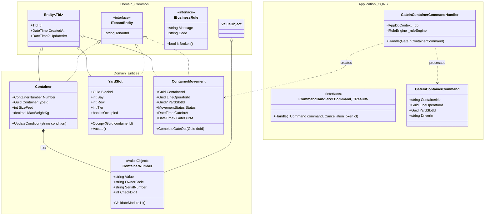

# Architecture Guide

## Clean Architecture Overview

This template implements **Clean Architecture** (a.k.a. Onion Architecture, Hexagonal Architecture) with four distinct layers:



## The Dependency Rule

> **Each layer only depends on the layer below it. Never upward.**

This is enforced by:
1. **Project references** — each `.csproj` only references inner layers
2. **Architecture tests** — automated tests verify no dependency violations at build time

### Domain Layer (`TechSpherex.CleanArchitecture.Domain`)

**Dependencies**: None (zero NuGet packages, except Identity for `ApplicationUser`)

**Contains**:
- `Entities/` — Business entities (`TodoItem`, `ApplicationUser`)
- `Common/` — Shared primitives:
  - `BaseEntity` — Base with `Guid Id`
  - `AuditableEntity` — Adds `CreatedAt`, `LastModifiedAt`, audit fields
  - `ITenantEntity` — Multi-tenant marker interface
  - `Result<T>` — Result pattern for explicit error handling
  - `Error` — Typed error with `Code`, `Message`, `ErrorType`
  - `PagedResult<T>` — Pagination wrapper

### Application Layer (`TechSpherex.CleanArchitecture.Application`)

**Dependencies**: Domain only

**Contains**:
- `Abstractions/` — Interfaces (ports):
  - `Messaging/` — `ICommand`, `IQuery`, `ICommandHandler<T>`, `IQueryHandler<T>`
  - `Data/` — `IAppDbContext`
  - `Identity/` — `ICurrentUser`, `ITokenService`
  - `Tenancy/` — `ITenantProvider`, `TenantInfo`
  - `Agents/` — `ISkillAgent`, `IAgentOrchestrator`, `AgentContext`, `AgentResult`
- `Features/` — Vertical slices per feature:
  - `Todos/` — Create, Get, GetAll, Update, Complete, Delete
  - `Identity/` — Register, Login, RefreshToken
  - `Agents/` — AgentOrchestrator, Skills

### Infrastructure Layer (`TechSpherex.CleanArchitecture.Infrastructure`)

**Dependencies**: Application

**Contains**:
- `Persistence/` — EF Core DbContext, Configurations, Migrations, Seeder
- `Identity/` — JWT TokenService, CurrentUser
- `Caching/` — HybridCache configuration
- `Tenancy/` — TenantProvider, TenantMiddleware

### Api Layer (`TechSpherex.CleanArchitecture.Api`)

**Dependencies**: Infrastructure, ServiceDefaults

**Contains**:
- `Endpoints/` — Minimal API endpoint groups
- `Extensions/` — GlobalExceptionHandler, ResultExtensions, ValidationFilter
- `Program.cs` — Application bootstrap

## CQRS Pattern (Manual)

We use **manual CQRS** — no MediatR, no licensing risk.

### Command Flow
```
Endpoint → ICommandHandler<TCommand, TResult> → DbContext → Database
```

### Query Flow
```
Endpoint → IQueryHandler<TQuery, TResult> → DbContext (no tracking) → Response
```

### Registration
Handlers are **auto-discovered** via assembly scanning in `DependencyInjection.cs`:
```csharp
services.AddHandlersFromAssembly(assembly); // Scans for ICommandHandler<,> and IQueryHandler<,>
```

## Multi-Tenancy Architecture

```
Request → TenantMiddleware → Resolve Tenant (Header/JWT/Default)
                                    ↓
                            Set TenantId in scope
                                    ↓
                    AppDbContext.SaveChanges → Auto-set TenantId
                    AppDbContext.Query → Global filter by TenantId
```

See [Multi-Tenancy Guide](multi-tenancy.md) for details.

## Skill Agents Architecture

```
POST /api/agents/execute { prompt: "..." }
         ↓
    AgentOrchestrator → Select Skill (keyword/LLM)
         ↓
    ISkillAgent.ExecuteAsync(context)
         ↓
    AgentResult (Success/Failure/NeedsMoreInfo)
```

See [Skill Agents Guide](skill-agents.md) for details.

## Key Design Decisions

| Decision | Why |
|----------|-----|
| **Manual CQRS** over MediatR | Zero licensing risk. MediatR is commercial since v13. |
| **Scalar** over Swagger UI | Modern, faster, better UX. |
| **HybridCache** over IMemoryCache | Built-in stampede protection, L1+L2 cache. |
| **Result pattern** over exceptions | Explicit error handling, no hidden control flow. |
| **Shared-table multi-tenancy** | Simple, no migration complexity, good for most SaaS apps. |
| **Interface-only agents** | No LLM provider lock-in. Plug in OpenAI, Ollama, etc. |
| **.slnx** over .sln | XML-based, merge-friendly, future .NET standard. |

---

## 📐 System Diagrams & UML Models

### 1. Entity-Relationship Diagram (ERD)



---

### 2. UML Use Case Diagram



---

### 3. UML Class Diagram (Domain & Application CQRS)



---

## 📥 Export & Visual Tools Integration

All diagrams are available in raw source files ready to be imported into **Draw.io**, **Lucidchart**, or **Microsoft Visio**:

- 🎨 **Draw.io / Visio XML**: [`docs/diagrams/depot-full-architecture.drawio`](diagrams/depot-full-architecture.drawio) *(Multi-tab diagram: ERD, Use Case, Class Diagram)*
- 📄 **Structured JSON Specification**: [`docs/diagrams/diagrams.json`](diagrams/diagrams.json) *(Entities, Attributes, Use Cases, Actors schema)*
- 💡 **How to open in Draw.io / Lucidchart**:
  1. Open [draw.io](https://app.diagrams.net) or [lucidchart.com](https://www.lucidchart.com).
  2. Choose **File** → **Open From** / **Import** → select `depot-full-architecture.drawio`.
  3. Or copy the Mermaid snippets above and go to `Arrange` → `Insert` → `Advanced` → `Mermaid`.

